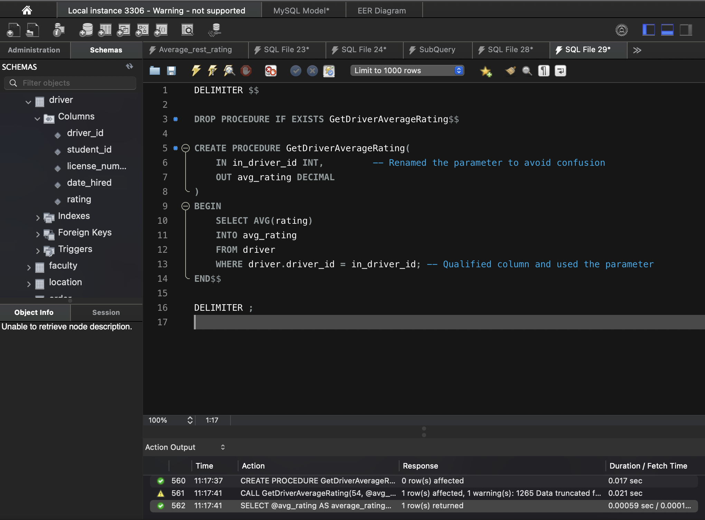
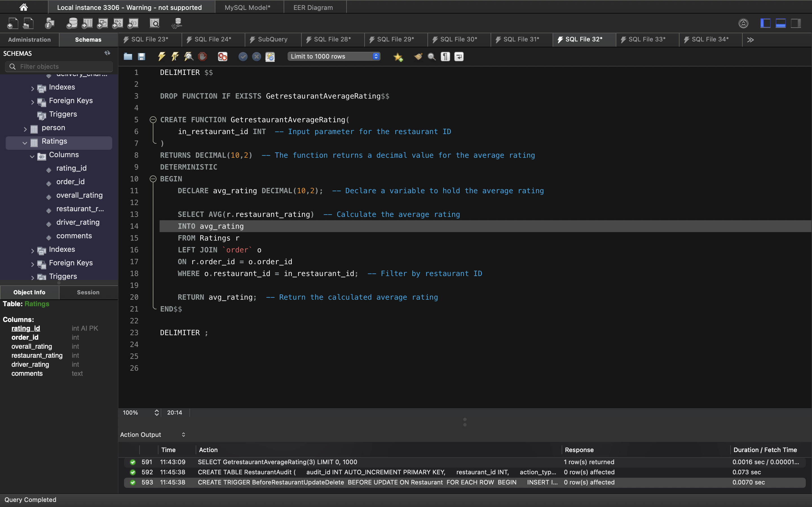
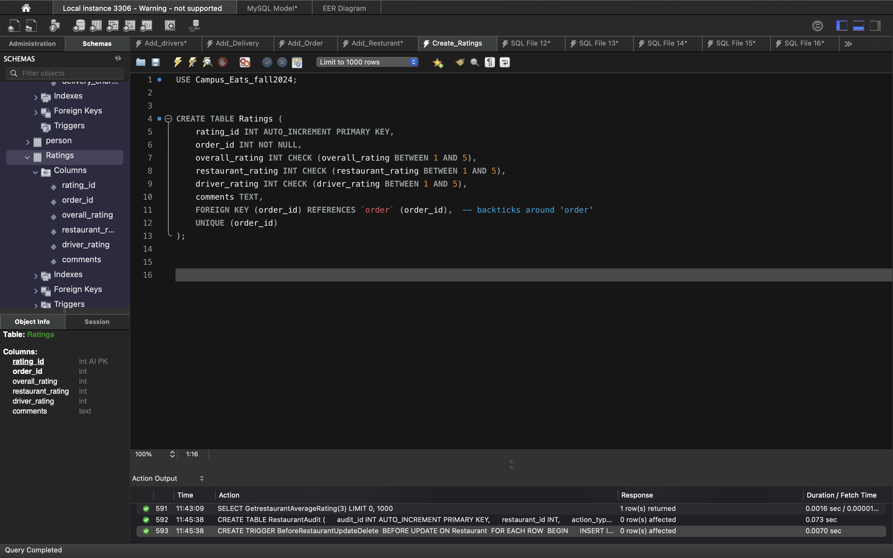
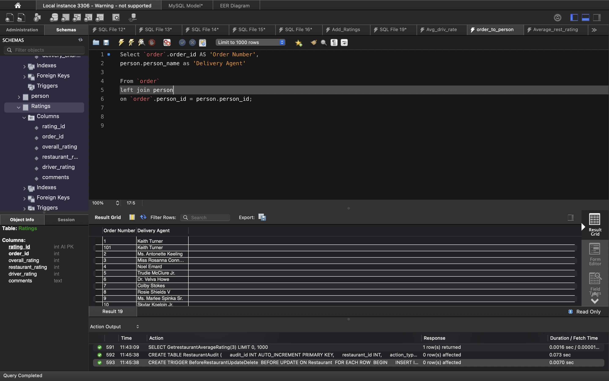

# Relational Db Project Using MySQL
Final database project for cis3212 database systems at catawba college
## Project overview 

##Database model 

##SQL statments

##ScreenShots

##System Specifications

MySql Workbench version 8.03
